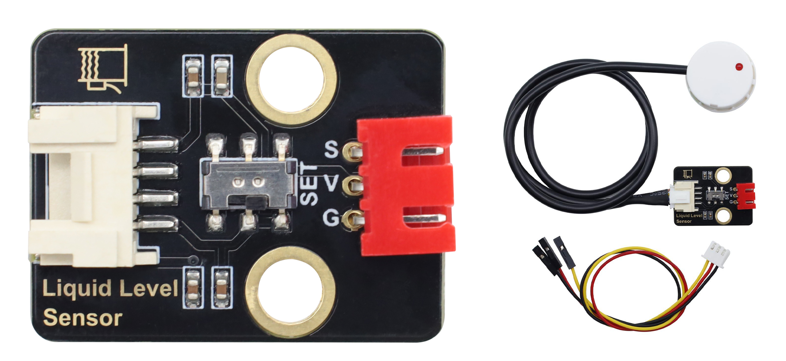
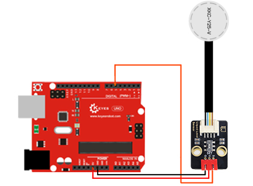

#  Keyes STEM电子积木 非接触型液位传感器 黑色环保（红色端子）




## 1. 介绍


非接触式液位传感器可突破容器壁厚的干扰，专门实现密闭容器内部液位高度的非接触式检测，适配各类密闭罐体的液位监测场景。该传感器配备XH2.54转接板，支持灵活的信号输出调节，可通过拨动开关切换电平输出模式，开关拨至SET侧时输出高电平，反向则输出低电平。设备可直接采集数字信号，兼容性极强，能够直连Arduino及各类主流主控器，接线便捷、适配性广，可快速搭建液位检测控制系统。


## 2. 规格参数


- **工作电压**：5 - 9V（兼容主流主控器）
- **工作电流**：≤20mA
- **检测方式**：非接触式（穿透容器壁检测）
- **适用容器材质**：塑料、玻璃、陶瓷、亚克力等非金属材质
- **最大穿透壁厚**：通常可达 5mm - 10mm（具体视容器材质和内部介质而定）
- **信号输出**：数字信号（TTL电平）
- **输出模式**：高电平有效 / 低电平有效（可通过板载拨动开关切换）
- **接口类型**：XH2.54 标准排针接口
- **工作温度**：1℃ ~ 50℃


## 3. 工作原理

非接触式液位传感器通常采用先进的电容式检测技术。传感器探头紧贴容器外壁，通过发射高频探测信号穿透容器壁，与容器内部的液体介质形成电容效应。当液位发生变化并达到传感器的检测位置时，介电常数的改变会引起电容值的显著变化。传感器内部的微处理器会实时监测这一变化，并将其转化为稳定的数字电平信号输出。由于检测过程完全在容器外部进行，因此无需破坏容器结构，彻底避免了液体腐蚀、泄漏等问题，同时也能有效克服容器壁厚及材质带来的干扰。

## 4. 接口描述


| 引脚名称 | 功能说明 | 接线建议 |
| :---: | :--- | :--- |
| **VCC** | 电源正极 | 连接主控器的 5V 电源引脚 |
| **GND** | 电源负极（地） | 连接主控器的 GND 引脚 |
| **S** | 数字信号输出 | 连接主控器的数字输入引脚|


## 5. 连接图


| KE4093模块引脚 | Arduino引脚 |
| -------------- | ----------- |
| VCC            | 5V          |
| GND            | GND         |
| S              | ~5          |




## 6. Arduino

```cpp
//*****************************************************************************
int Liquid_level = 0;
void setup() {
  Serial.begin(9600);
  pinMode(5, INPUT);
}

void loop() {
  Liquid_level = digitalRead(5);
  Serial.print("Liquid_level= "); Serial.println(Liquid_level, DEC);
  delay(500);
}
//*****************************************************************************
```
在开发板上上传代码后，将传感器探头轻压在待测容器壁上。
开关拨动至SET一侧：当检测到液位时，OUT脚输出高电平，液位传感器指示灯亮，否则输出低电平，液位传感器灯灭。          
开关拨动至SET另一侧：当检测到液位时，OUT脚输出低电平，液位传感器指示灯灭，否则输出高电平，液位传感器灯亮。


## 7. 常见问题与故障排除

在调试和使用过程中，如遇到问题可参考下表进行排查：

| 问题现象 | 可能原因 | 解决办法 |
| :--- | :--- | :--- |
| **传感器无任何输出** | 接线错误或电源未接通 | 检查 VCC、GND、S引脚接线是否牢固，使用万用表确认供电电压在 5V-9V 之间。 |
| **始终输出高/低电平，状态不变化** | 容器材质为金属，或探头未贴紧容器壁 | 确保容器为非金属材质；使用胶带或硅胶将传感器探头与容器外壁紧密贴合，彻底消除空气间隙。 |
| **信号输出不稳定，频繁跳变** | 受到外部电磁干扰或杜邦线接触不良 | 检查杜邦线是否松动；将设备远离电机等强干扰源；必要时在信号线上增加上拉或下拉电阻。 |
| **检测灵敏度低或完全无法检测** | 容器壁过厚，或内部介质介电常数过低 | 确认容器壁厚在传感器规格允许范围内；尝试更换检测介质（如用水代替其他低介电常数液体）或调整传感器安装位置。 |
